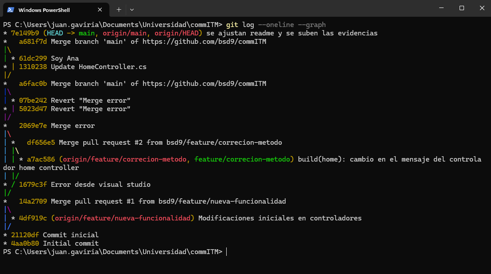

# Despliegue De Software - Grupo CommITM
Repositorio creado para la asigantura de despliegue de software, para realizar pruebas con el git y realizar desarrollo colaborativo.

## Integrantes
- Juan David Gaviria Correa
- Ana Maria Valencia Quintero
- Juan David Osorio Zapata
- Johan Sneider Garzon Salazar
- Fabian Jussep Rios Ferrer

## Notas
Se adjuntan **evidencias** en la carpeta [evidencias](./evidencias).

## Commits

